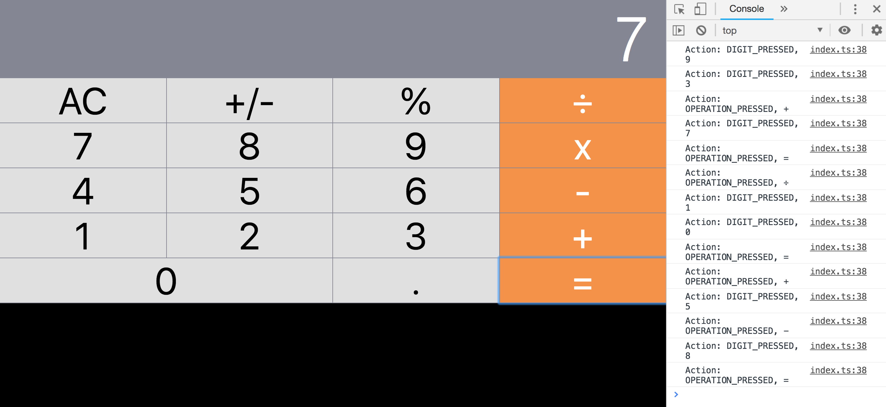

# React-Redux-Calculator

   

#### Motivation
The aim of this project is to make an apple style basic calculator with React and Redux. Redux helps with maintaining a global state that can only be modified via appropriate reducers. The visual components receive state through props and dispatch appropriate events when they receive user events such as mouse clicks. The new state is generated in Redux declaratively and is a function of the old state and the new action performed. All actions passing through Redux are logged in the console with the help of a logging middleware. 

### [Try it online](https://codesandbox.io/s/github/THEhEROLocker/react-redux-calculator) 